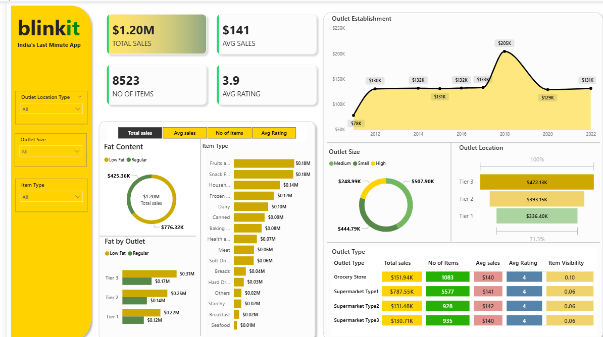

# 🛒 Blinkit-Sales-Analysis-Dashboard-PowerBi

## 📌 One Line Summary
An interactive Power BI dashboard that analyzes Blinkit sales data to provide insights into sales performance, outlet trends, item categories, and customer ratings.

---

## 📖 Project Overview
This project focuses on analyzing Blinkit (India’s Last Minute App) sales data using **Power BI**.  
The dashboard transforms raw Excel data into meaningful visual insights that help understand overall sales performance, outlet-wise contribution, item distribution, and customer behavior.

The project is designed as a **business intelligence dashboard** suitable for decision-making and performance monitoring.

---

## ❓ Problem Statement
Blinkit wants to analyze its sales data to:
- Monitor total and average sales
- Identify top-performing outlets and item categories
- Understand customer ratings and item visibility
- Compare performance across outlet sizes and locations
- Enable data-driven business decisions

---

## 📂 Dataset
- **File Name:** `blinkit excel file.xlsx`
- **File Type:** Excel (.xlsx)
- **Description:**  
  The dataset includes:
  - Item Type
  - Fat Content
  - Outlet Size, Type, and Location
  - Total Sales
  - Item Visibility
  - Customer Ratings
- **Source:** Public dataset (used for learning and analysis)

---

## 🛠 Tools & Technology
- **Power BI Desktop**
- **Microsoft Excel**
- **Power Query**
- **DAX (Data Analysis Expressions)**
- **GitHub**

---

## 🔍 Methods Used
- Data Cleaning & Transformation using Power Query
- Data Modeling
- Creation of calculated measures using DAX
- KPI analysis:
  - Total Sales
  - Average Sales
  - Number of Items
  - Average Rating
- Interactive dashboard development using slicers and visuals

---

## 📊 Key Insights
- **Total Sales:** $1.20M
- **Average Sales:** $141
- **Number of Items:** 8,523
- **Average Rating:** 3.9
- Tier 3 outlets contribute the highest sales
- Medium-sized outlets perform better than small and large outlets
- Fruits, snacks, and household items generate the most revenue
- Regular fat content products have higher sales than low-fat products

---

## 📈 Dashboard / Output
The Power BI dashboard includes:
- KPI cards for sales and performance metrics
- Outlet establishment trend analysis
- Sales by outlet size and location
- Item-type and fat-content analysis
- Outlet-type comparison tables

📌 **Dashboard Screenshot:**  


📌 **Dashboard File:** Power BI `.pbix` file  
(Note: GitHub does not support previewing `.pbix` files. Please download and open using Power BI Desktop.)

---

## ▶️ How to Run This Project
1. Clone the repository:
   ```bash
   git clone https://github.com/khushi210102/Blinkit-Sales-Analysis-Dashboard-PowerBi.git

---

## ✅ Results & Conclusion

This project successfully converts Blinkit sales data into a visually rich and interactive dashboard.
It enables quick identification of trends, high-performing outlets, and customer preferences, supporting informed business decisions.

---

## 🔮 Future Work

- Add time-series forecasting
- Perform customer segmentation analysis
- Publish dashboard on Power BI Service
- Integrate real-time or live datasets

---

## 👤 Author & Contact

- Name: Khushi Kumari
- GitHub: https://github.com/khushi210102
- LinkedIn: https://www.linkedin.com/in/khushi-kumari-a6b556286/
